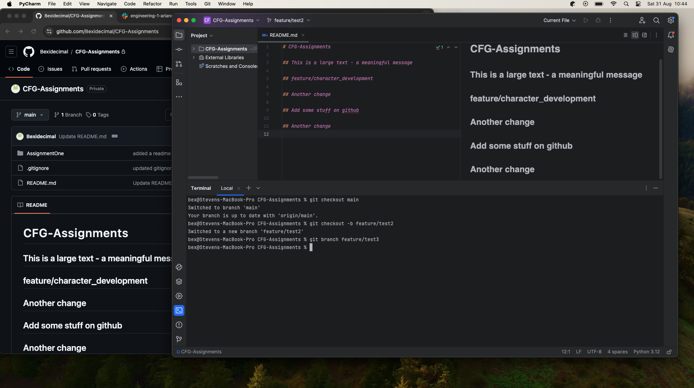
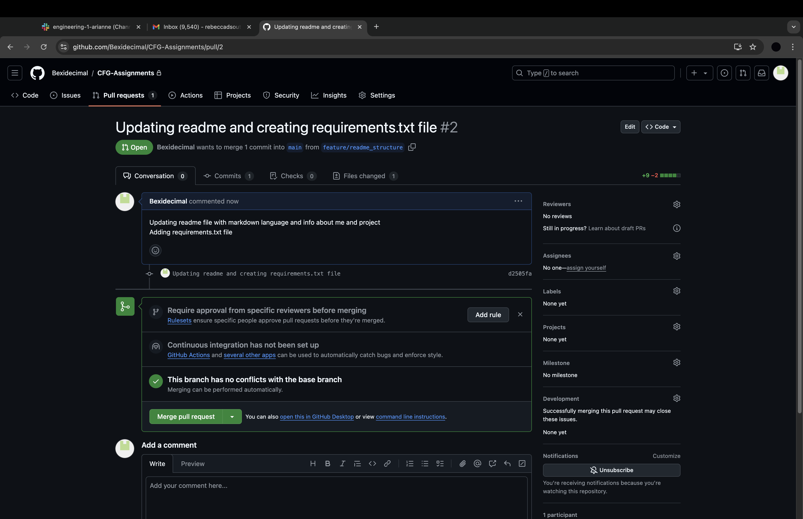

# CFG Assignments
_______
This repository is to complete assignments and practice skills for the CFG Software Engineering degree.

I have joined the CFG degree as I am looking for a career change, after completing a web dev kickstarter a few months ago I am hoping that coding is the right career path for me! 
I am currently an area manager in the railway, I oversee the running of 2 busy London stations. 

I have one other repository on Github which I have used to upload my project from the webdev kickstarter. I intend to use this repository to practice the principles taught in the degree
and create an even better project! 

### Assignment One
For assignment one, I will be demonstrating my knowledge of git and github by completing the assignment set by CFG.

I have added explanations for what a .gitignore file and requirements.txt file are for. I have added these explanations 
within the files themselves. I have shown examples of markdown language. I have also added screenshots below to 
demonstrate my work
________
## Examples of Markdown

## This is a large text - Heading 1

### This is smaller text - Heading 2

#### This is the smaller text - Heading 3

## List Items
- List item 1
- List item 2
- List item 3
- List item 4

**Bold Text** 

*Italic Text*

> blockquote
________
### Screenshots for Assignment 1

Use of git commands in the terminal

Use of markdown language

Showing branch log

Checking status with the terminals

Commit and push with a meaningful message

Opening a pull request

Pull request

Pull request 2

Successful Merge into main branch

______________
## Project Contributors
| **Name**                                        | Role             |
|-------------------------------------------------|------------------|
| [Bexidecimal](https://github.com/Bexidecimal)   | Owner/Student    |
| [azzywazzy](https://github.com/azzywazzy)       | Assistant Instructor |
| [helenijevans](https://github.com/helenijevans) | Marker           |

