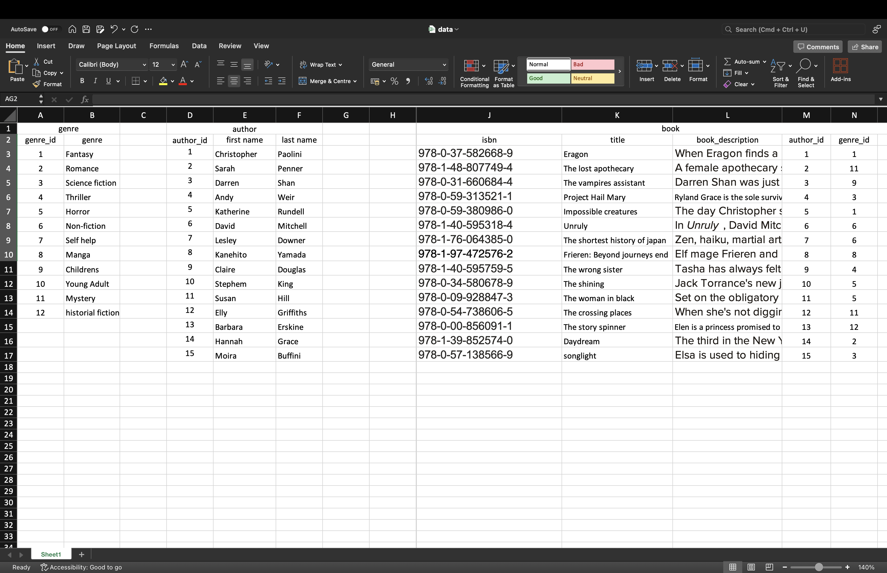
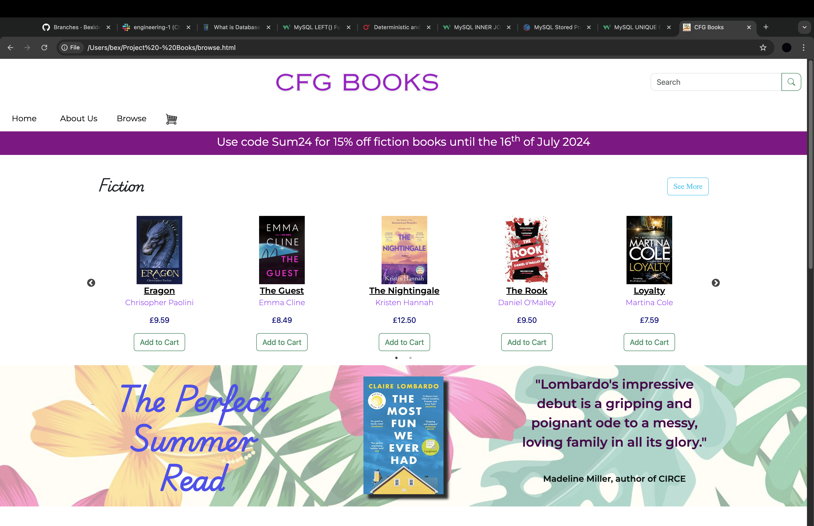

# Assignment three
_____
For assignment three I created a database that links to an online bookshop, I had created a website in my webdev course. 
The database has tables for customer order and details, with information on books that could be purchased. Including, 
author and genre information and price. 

I created an ER diagram in MYSQL workbench to easily refer to the data structure and I outlined my data types. I also made sure to create
links between the tables with primary and foreign keys. I initially created my data in Excel to make it easier to organise
later on. I have provided a screenshot of the first part of the Excel sheet to show my data modelling. I really enjoyed
choosing customers, I based them on my favourite book characters with references to their stories in their contact information.

When I initially created the tables, I did make a mistake with the customer title, I created this as a VARCHAR(3) but soon 
realised when trying to upload information to my tables that "miss" is 4 characters not 3. This required an ALTER TABLE statement 
to correct it. 

I created 7 tables as I initially only created 5 which showed the book information and customer information. However, I 
wanted to show how these separate bits of information would be joined in a real world scenario, how customer information interacts
with the book information via an order. With this in mind, I based my queries on those I would expect customer to make or the website
to perform. For example, order information, open orders etc. I've also included some screenshots below of the unfinished website I used as inspiration for this project.

____

### Screenshots

**Excel spreadsheet**

**Unfinished homepage for CFG books, used as inspiration**

**Browse page, used as inspiration**

