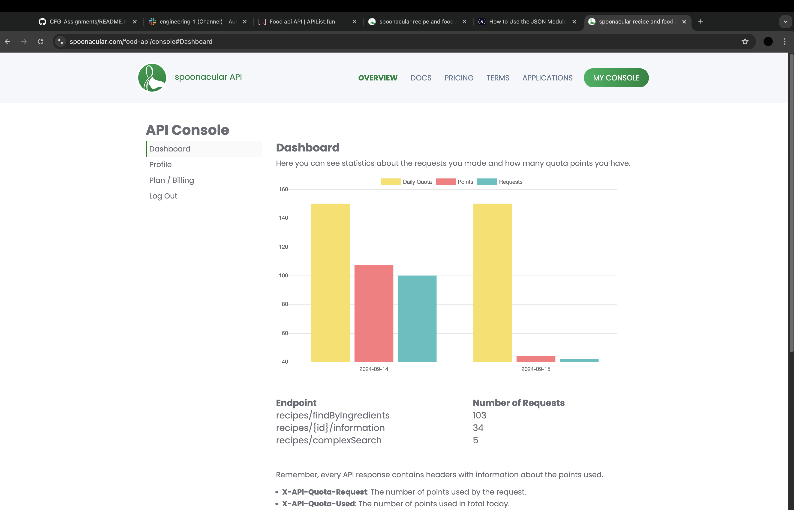

# Assignment two
_______

For assignment two I have produced a text based program that allows the user to input a string of comma separated ingredients 
and returns a list of recipes that contain these ingredients. 

I have used two APIs to achieve this, the first to return the recipe list, the second to find and provide more information
on the recipes that the user have chosen. 

My program also allows the user to save any recipes they find appealing to a file which they can access later. The information
returned and saved also provides a url which takes the user to the webpage with the recipe. 

______

### Installation steps

1. Go to https://spoonacular.com/food-api click on pricing and sign up to their free tier. This allows 150 requests per day.
2. You can obtain your API key by clicking my console > profile > show/hide API key.
3. Create a secrets file in your root folder.
4. Copy and paste the API key to this file, ensure there are no line breaks or it won't work.
5. As per the requirements.txt, install the requests library. This can be done by typing import requests at the top of your code. hover your mouse over the word requests, click and wait for a pop up to appear. Once this appears click on install.

### How to run the program
1. Open the ```assignment_two_recipes.py```
2. right click on the page and click run
3. Follow the commands

______

### Screenshots

**API calls**

**Screenshot of the 1st API used to find recipe by ingredient**

**Screenshot of the 2nd API used to find more info on chosen recipes**

**Reviewing API data in insomnia 1**

**Reviewing API data in insomnia 2**

